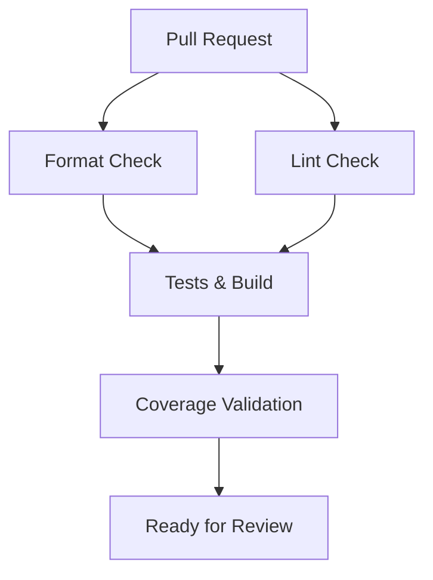
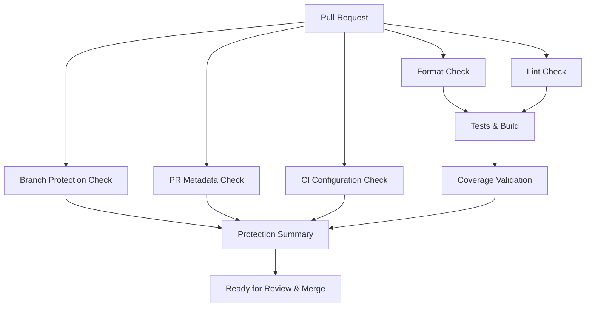

# Branch Protection Setup

This document explains how to configure branch protection for the expense-svc repository to ensure code quality and prevent accidental changes to the main branch.

## 🛡️ Automated Protection (GitHub Actions)

The repository includes a GitHub Actions workflow (`.github/workflows/branch-protection.yml`) that automatically:

- ✅ **Blocks direct pushes** to master/main branch
- ✅ **Validates PR metadata** (title format, description)
- ✅ **Ensures CI configuration** is complete
- ✅ **Provides protection summary** for each PR

## 🔧 Manual GitHub Settings (Repository Admin Required)

To complete the branch protection setup, a repository administrator must configure the following settings in the GitHub web interface:

### Step 1: Navigate to Branch Protection Settings

1. Go to your repository on GitHub
2. Click **Settings** tab
3. Click **Branches** in the left sidebar
4. Click **Add rule** or edit existing rule for `master` branch

### Step 2: Configure Protection Rules

Configure the following settings for the `master` branch:

#### ✅ Required Settings

```
☑️ Require a pull request before merging
  ☑️ Require approvals: 1
  ☑️ Dismiss stale reviews when new commits are pushed
  ☑️ Require review from code owners (if CODEOWNERS file exists)

☑️ Require status checks to pass before merging
  ☑️ Require branches to be up to date before merging
  
  Required status checks:
  - Code Formatting (format-check)
  - Code Linting (lint-check) 
  - Tests and Build (test)
  - Branch Protection Checks (branch-protection)
  - PR Metadata Check (pr-metadata-check)
  - Validate CI Configuration (validate-ci-checks)
  - Branch Protection Summary (branch-protection-summary)

☑️ Require conversation resolution before merging

☑️ Restrict pushes that create files larger than 100MB

☑️ Block force pushes

☑️ Do not allow bypassing the above settings
```

#### 🔄 Optional Settings

```
☐ Require signed commits (recommended for production)
☐ Require linear history (creates cleaner git history)
☐ Include administrators (applies rules to admins too)
```

### Step 3: Verify Protection is Active

After saving the settings, verify that:

1. ✅ The `master` branch shows a shield icon indicating protection
2. ✅ Direct pushes to master are blocked
3. ✅ PRs require the specified status checks to pass
4. ✅ PRs require at least 1 approval before merging

## 🚦 Workflow Integration

The branch protection workflow integrates with the existing CI/CD pipeline:

### Current CI Pipeline (`ci.yml`)


### Enhanced with Branch Protection (`branch-protection.yml`)


## 📋 Developer Workflow

With branch protection enabled, developers must follow this process:

### 1. Create Feature Branch
```bash
git checkout master
git pull origin master
git checkout -b feature/my-new-feature
```

### 2. Make Changes
```bash
# Make your changes
git add .
git commit -m "feat: add new feature"
```

### 3. Push and Create PR
```bash
git push origin feature/my-new-feature
# Create PR via GitHub UI
```

### 4. Ensure All Checks Pass
- ✅ Format check must pass
- ✅ Lint check must pass  
- ✅ All tests must pass
- ✅ Build must succeed
- ✅ Coverage thresholds must be met
- ✅ Branch protection checks must pass

### 5. Get Review and Merge
- Wait for required approvals
- Merge via GitHub UI (never force push to master)

## 🚫 What's Blocked

The following actions are blocked on the `master` branch:

- ❌ Direct pushes (`git push origin master`)
- ❌ Force pushes (`git push --force`)
- ❌ Merging PRs with failing checks
- ❌ Merging PRs without required approvals
- ❌ Large file uploads (>100MB)

## ⚠️ Emergency Procedures

In case of critical hotfixes, repository administrators can:

1. **Temporarily disable protection** (not recommended)
2. **Create emergency branch** and follow expedited review process
3. **Use admin override** (if "Include administrators" is disabled)

## 🔍 Monitoring

Branch protection status can be monitored via:

- **GitHub Actions tab**: View workflow runs and status
- **Pull Request checks**: See required status checks at bottom of PR
- **Branch settings**: Verify protection rules are active
- **Repository insights**: Monitor merge patterns and compliance

## 📚 Additional Resources

- [GitHub Branch Protection Documentation](https://docs.github.com/en/repositories/configuring-branches-and-merges-in-your-repository/defining-the-mergeability-of-pull-requests/about-protected-branches)
- [GitHub Actions Documentation](https://docs.github.com/en/actions)
- [Conventional Commits Specification](https://www.conventionalcommits.org/)

---

**Note**: Some settings require repository administrator privileges. Contact your repository admin to configure the GitHub UI settings described in this document. 